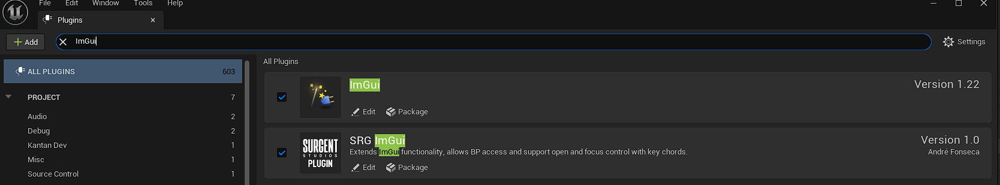
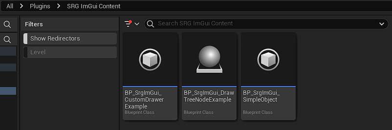
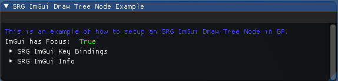
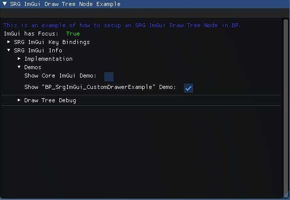
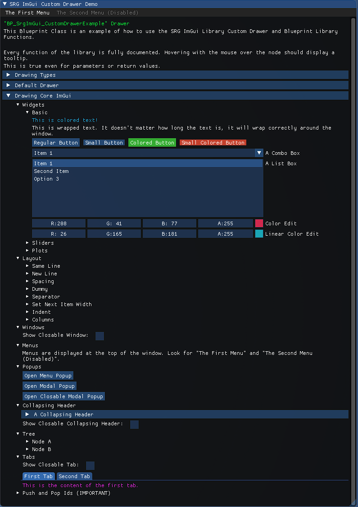

SRG ImGui Plugin
-------------

**SRG ImGui** plugin is intended as an extension of the **ImGui** plugin and requires it to work. More information in the [setup section](#implementing-the-plugin).
The plugin is compatible with **Unreal 5.4 and 5.5**. Other versions of Unreal Engine might require modifications to this plugin in order to compile.

# Table of Contents
- [Feature Summary](#feature-summary)
- [Minimal Setup](#minimal-setup)
    - [Implementing the plugin](#implementing-the-plugin)
    - [Opening ImGui](#opening-imgui)
- [Key Bindings](#key-bindings)
- [Draw Tree](#draw-tree)
    - [Implementation](#implementation)
    - [Registration](#registration)
    - [Ordering](#ordering)
- [Property Inspector](#property-inspector)
    - [Inspector Functions](#inspector-functions)
    - [Constant vs Mutable Properties](#constant-vs-mutable-properties)
    - [Custom Drawer](#custom-drawer)
    - [Core ImGui in BP](#core-imgui-in-bp)
- [ImGui in Shipping Builds](#imgui-in-shipping-builds)


## Feature Summary
This plugin extends the functionality of ImGui in the following ways:
- Initializes ImGui automatically with the hooks required for full BP-only usage.
- Handles visibility and focus on ImGui through rebindable key combinations.
- Activates gamepad and keyboard navigation by default.
- Uses a tree structure to draw in ImGui allowing a very flexible design.
- Implements a complete Unreal property inspector capable of displaying and modifying any variable at runtime.

## Minimal Setup

### Implementing the plugin
To use this plugin you need a C++ Unreal project.
Place the contents of this repository and the **ImGui** repository under *{Project Root}/Plugins/{PluginName}*. ***{PluginName}*** should be ***SrgImGui*** for this plugin and ***ImGui*** for the **ImGui** plugin.

There are multiple version of the **ImGui** plugin:
- The [original version](https://github.com/segross/UnrealImGui) for Unreal Engine 4 (will fail to compile with Unreal 5.4 and 5.5).
- [IDI-Systems](https://github.com/IDI-Systems/UnrealImGui)' fork of the original that has been kept up to date at the time of writing. This is the **recommended version** for this plugin.
- **Note:** For projects that use **Common UI** in their game, the current **ImGui** plugins do not fully work with controller unless [a fix](https://github.com/SurgentStudios/UnrealImGui/commit/7ae4e897f80e1a9f84ae7e4756683e6beb4f9f8e) is applied. A [pull request](https://github.com/IDI-Systems/UnrealImGui/pull/33) has been provided to the [IDI-Systems](https://github.com/IDI-Systems/UnrealImGui)'s version of the plugin. It has not been merged into the repository at the time of writing.

After placing the plugins in the correct folder and loading the project go to:
```
Edit → Plugins
```
Here search for ImGui and turn on both plugins. This will require an engine restart.


### Opening ImGui

This plugin contains some examples of how to use it in Blueprints in its content folder.
You can find them in the Editor Content Browser:


Make sure that [Show Plugin Content](./Images/ShowPluginContent.png) is turned on in the content browser settings.

Add ***BP_SrgImGui_DrawTreeNodeExample*** into the current level and this will act as the root node of the draw tree. This is just meant as an example. Do not use it in the final game. More information in the [Draw Tree](#draw-tree) section.

Finally, play in editor and toggle ImGui visibility. By default the keybinds to toggle visibility are:
- **Keyboard -** "Left Ctrl" + "="
- **Gamepad -** "Left Thumbstick Button" + "Special Right" ("Special Right" is equivalent to the "Menu" button on an Xbox Controller)

ImGui should then open a window. ***BP_SrgImGui_DrawTreeNodeExample*** draws useful information including a complete self-contained documentation. Most of the following documentation matches the it.


## Key Bindings

This plugin provides key bindings for 2 functionalities:
- **Toggle Visibility -** Shows/Hides ImGui.
   - **Default Keyboard Binding -** "Left Ctrl" + "="
   - **Default Gamepad Binding -** "Left Thumbstick Button" + "Special Right" ("Special Right" is equivalent to the "Menu" button on an Xbox Controller)

- **Toggle Focus -** Swaps the current input focus between the game and ImGui.
   - **Default Keyboard Binding -** "Left Ctrl" + "-" (Hyphen)
   - **Default Gamepad Binding -** "Left Thumbstick Button" + "Special Right" ("Special Right" is equivalent to the "Menu" button on an Xbox Controller)

Default key bindings can be overwritten in the project settings. 

The key bindings are listened through an Input Processor that has higher priority than the game itself and can consume inputs. Only the last input of the key chord is consumed. By default the input processor priority is 0 so it's the first input processor to listen to inputs and is never blocked. If this is causing issues, this value can be modified in the project settings.

Input settings can be modified in the project settings through:
```
Edit -> Project Settings... -> SRG -> SRG ImGui -> Input
```

## Draw Tree

The Draw Tree structure is used by the SRG ImGui plugin to decide what to draw and in which order.

### Implementation
To add an object to the draw tree, it must implement the ***SRG ImGui Draw Tree Node*** interface.\
The object must then register and unregister to the draw tree through the SRG ImGui Subsystem at a valid time (Usually ***Begin Play*** for registering and ***End Play*** for unregistering). The same object can register to multiple tags in order to draw in multiple contexts (more information in the [Registration](#registration) section).

The interface provides two functions for drawing: ***Start*** and ***End***. For both functions, the currently drawn tag is passed as a parameter to allow objects registered to multiple tags to distinguish the current draw tree node.\
The ***Start*** function is called before the node's children are drawn and the ***End*** function after (more information in the [Ordering](#ordering) section).

Open ***BP_SrgImGui_DrawTreeNodeExample*** for an example of how to implement the ***SRG ImGui Draw Tree Node*** interface (more information about the location of this file in the [Opening ImGui](#opening-imgui) section).

### Registration
The draw tree is drawn using gameplay tags that are descendants of ***"SrgImGui.DrawTree"***. This tag is the root of the tree and must be registered.\
One and only one object can be registered per tag. However, an object can register to multiple tags (more information in the [Implementation](#implementation) section).

When registering a node there are options to deal with the situation where the selected tags or object are already registered but it's better to avoid this issue in the first place. For that reason, it's highly recommended that only singleton objects register to the draw tree. Examples of singleton objects are the *game instance*, *game mode*, *game state* or *subsystems* (C++ only).

If a tag is not registered, none of its children will be drawn, even if they are registered. As an example, if the tag ***"A.1"*** is registered but ***"A"*** is not, then ***"A.1"*** will not be drawn.

### Ordering
By default, the draw tree is drawn in the same order as the registered tags. For each node in the tree:

1. The ***Start*** draw method is called.
2. All the node's children are drawn. For each child, go to step 1.
3. The ***End*** draw method is called.

Note that step 2 and 3 can be skipped based on the return value of the ***Start*** method:
- **Continue -** No steps are skipped.
- **Skip Children -** Step 2 is skipped.
- **Stop -** Both step 2 and 3 are skipped.

Children are sorted alphabetically by default (same sorting method as gameplay tags). However, if a custom order is required one can be specified in the project settings through:
```
Settings... -> SRG -> SRG ImGui -> Draw Tree -> Draw Tree Priority
```
Tags specified in the settings will draw first by their order in the array. Tags that are not specified in the settings will draw after specified ones in alphabetical order.

## Property Inspector
This plugin includes methods to draw any property type.

Open ***BP_SrgImGui_CustomDrawerExample*** for an example of how to implement the features described in this section (more information about the location of this file in the [Opening ImGui](#opening-imgui) section).

### Inspector Functions
The following functions can be used to draw each property type:

| | Blueprint | C++ |
|---|---|---|
|**Bool**| ImGui - Bool | USrgImGuiTypeLibrary::DrawBool |
|**Int32**| ImGui - Integer | USrgImGuiTypeLibrary::DrawInt32 |
|**Int64**| ImGui - Integer 64 | USrgImGuiTypeLibrary::DrawInt64 |
|**Uint8**| ImGui - Byte | USrgImGuiTypeLibrary::DrawUInt8 |
|**Double**| ImGui - Float | USrgImGuiTypeLibrary::DrawDouble |
|**String**| ImGui - String | USrgImGuiTypeLibrary::DrawString |
|**Name**| ImGui - Name | USrgImGuiTypeLibrary::DrawName |
|**Text**| ImGui - Text | USrgImGuiTypeLibrary::DrawText |
|**Enum**| ImGui - Enum | USrgImGuiTypeLibrary::DrawEnum |
|**Class**| ImGui - Class | USrgImGuiTypeLibrary::DrawClass |
|**Soft Class**| ImGui - Soft Class | USrgImGuiTypeLibrary::DrawClass |
|**Struct**| ImGui - Struct | USrgImGuiTypeLibrary::DrawStruct |
|**Object**| ImGui - Object | USrgImGuiTypeLibrary::DrawObject |
|**Array**| ImGui - Array | *(not available; read below)* |
|**Set**| ImGui - Set | *(not available; read below)* |
|**Map**| ImGui - Map | *(not available; read below)* |

There are also some extra templated functions that are C++ only.
- ***USrgImGuiTypeLibrary::DrawStructProperty* and *USrgImGuiTypeLibrary::DrawObjectProperty -*** Can be used to draw any property by passing the struct/object container as a parameter. This is the only way to directly inspect Arrays, Maps and Sets in C++.
- ***USrgImGuiTypeLibrary::DrawPrimitive -*** Can be used to draw all primitives (bool, uint8, int8, uint16, int16, uint32, int32, uint64, int64, float, double).
- ***USrgImGuiTypeLibrary::DrawStringT -*** String, Name, Text.

### Constant vs Mutable Properties
By default, each property is drawn as read-only (constant).

Most properties can be drawn as mutable through a parameter when calling the corresponding inspector function.\
The exception is objects. An object will draw all its properties as constant unless it implements the ***SRG ImGui Mutable*** interface. To note that when implementing this interface it is only applied to the class itself and its descendants. When inspecting a parent class properties through an object that  implements ***SRG ImGui Mutable*** those properties will still be read-only.

### Custom Drawer
Objects can override how they are drawn through the inspector by implementing the ***SRG ImGui Custom Drawer***.

The interface contains a ***Draw*** function where the custom draw behavior should be specified. If left empty, the inspector will not draw anything for an object that implements this interface. Every single property needs to be manually added.

It is still possible for a custom drawer to internally draw the default inspector by calling ***ImGui - Default Custom Drawer* (BP)** or ***USrgImGuiTypeLibrary::DrawDefaultCustomDrawer* (C++)** inside the ***Draw*** function. This is the recommended pattern when the intent is to add information to the inspector instead of replacing it.

### Core ImGui in BP

We support an extensive number of core ImGui functions in BP.\
Open ***BP_SrgImGui_CustomDrawerExample*** for an example of how to implement the features described in this section (more information about the location of this file in the [Opening ImGui](#opening-imgui) section). The demo is also available in the ImGui in-game documentation (Editor only).





## ImGui in Shipping Builds

By default, ImGui is disabled in Shipping builds.

This can be modified in the project settings. Toggle:
```
Edit -> Project Settings... -> SRG -> SRG ImGui -> Shipping -> Available in Shipping
```